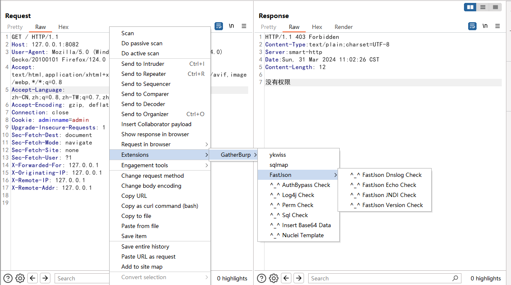
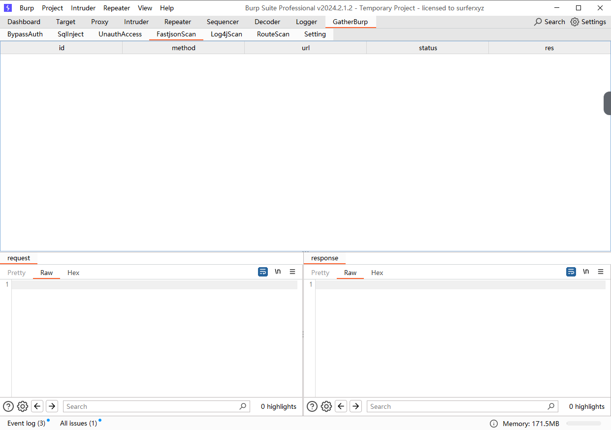
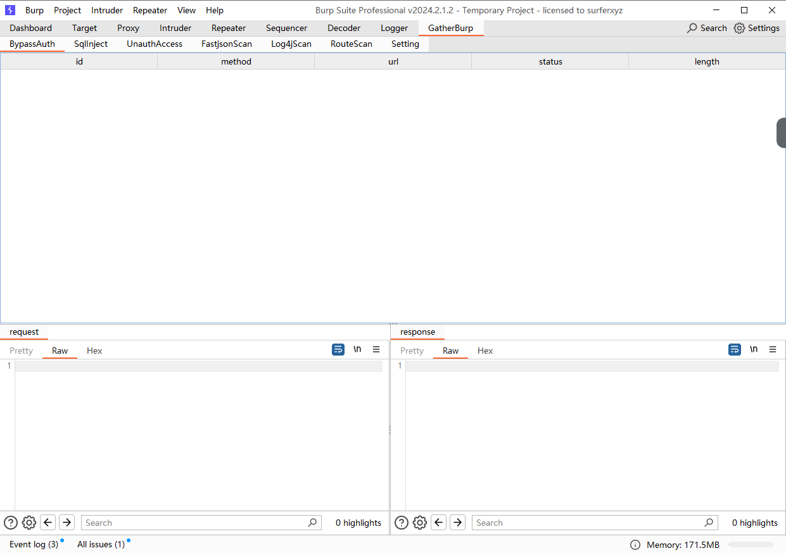
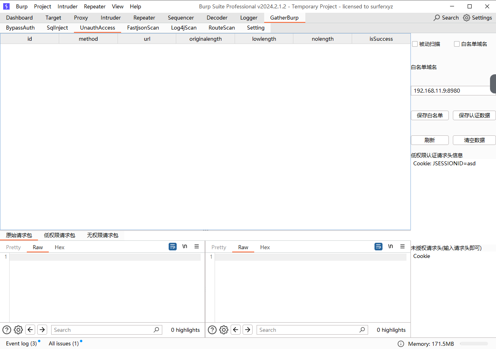
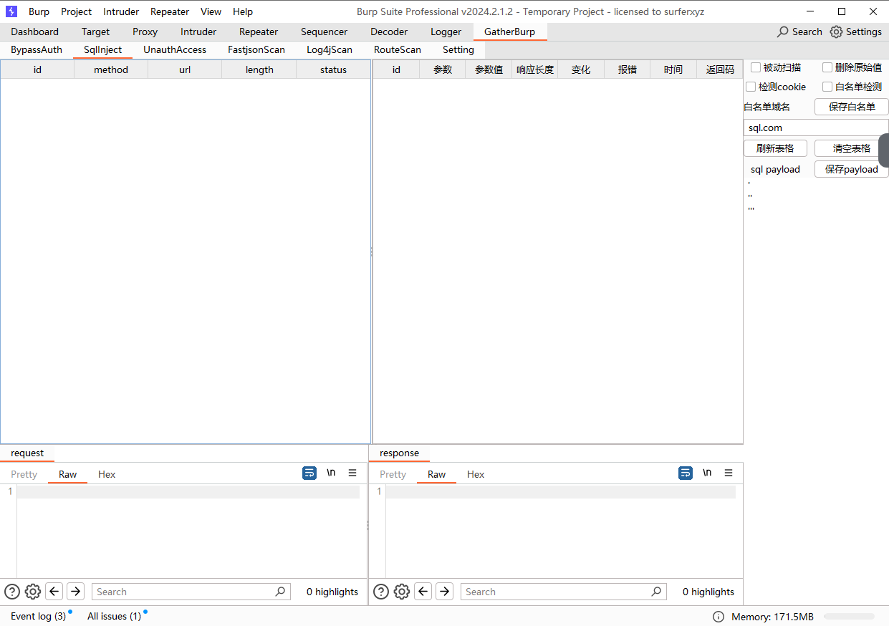
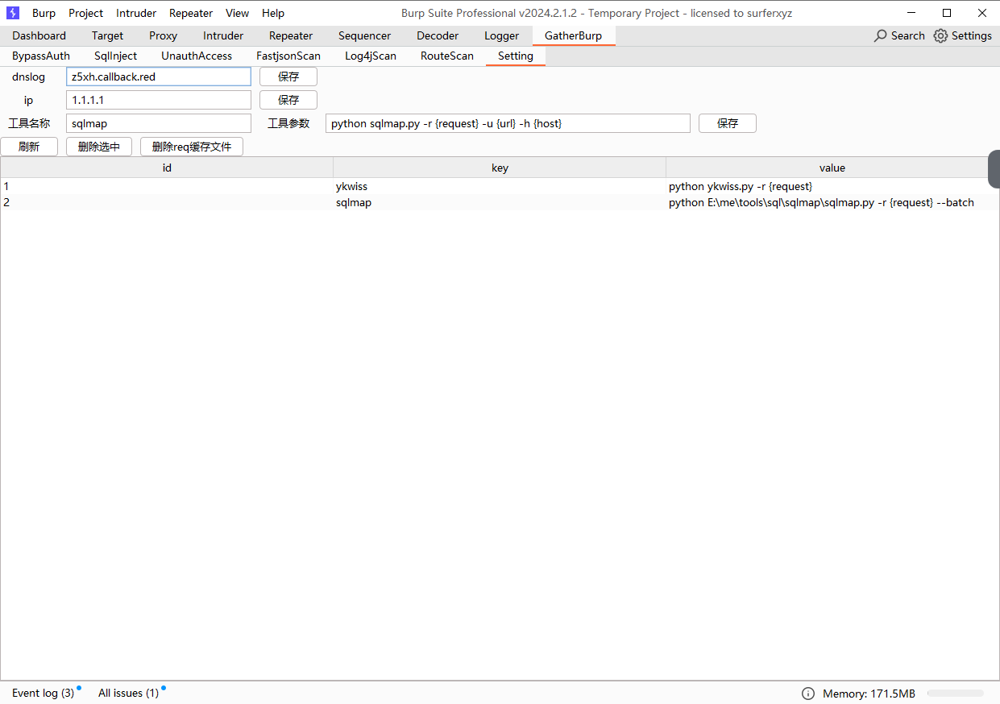
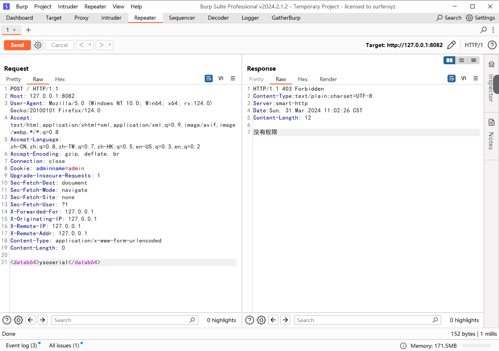
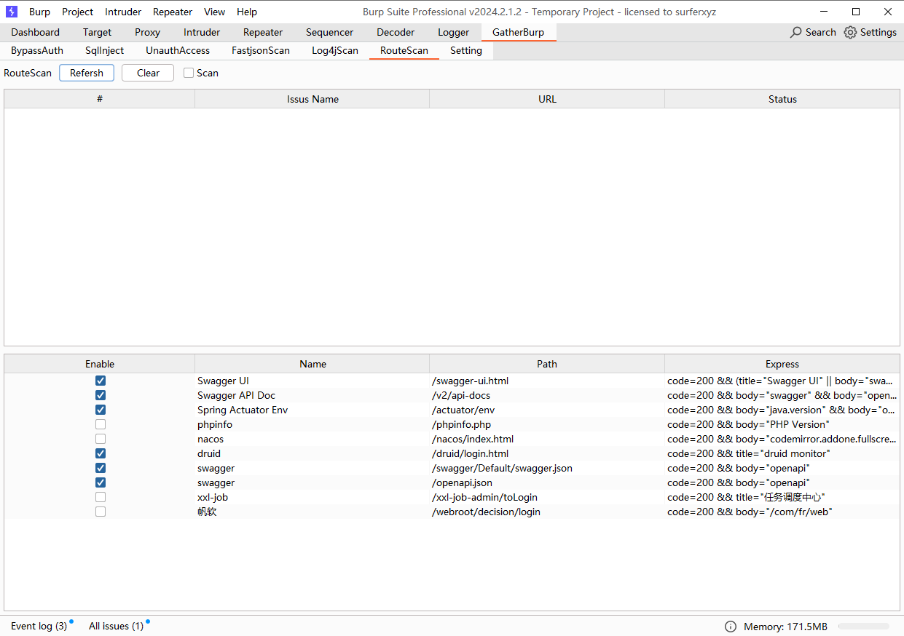
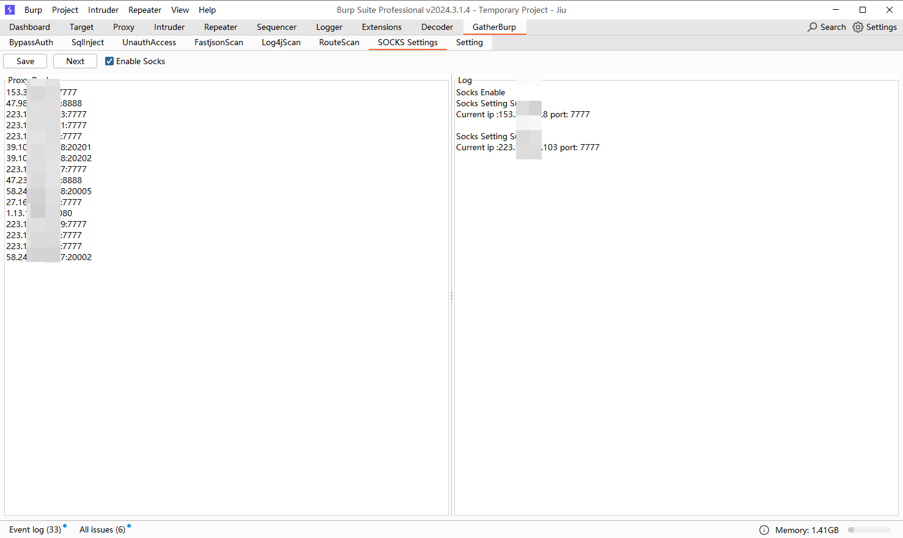
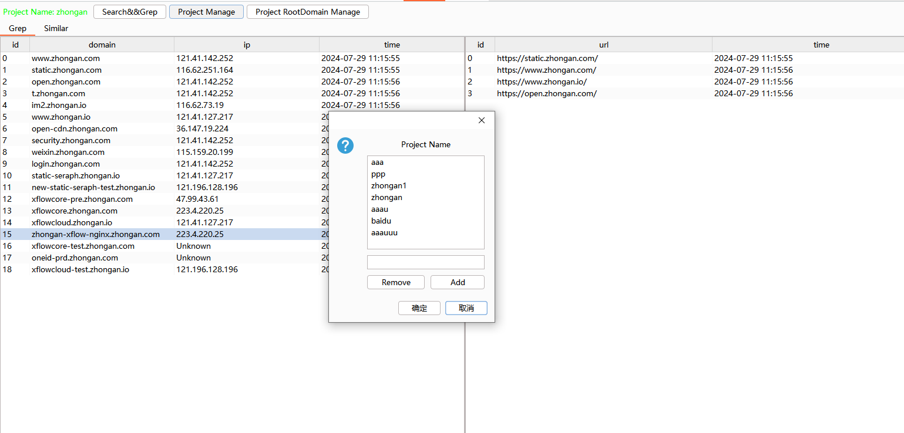

> 希望大家有好的idea,可以提issue,我会尽量实现


# 加群

1. 加入wx群:


# 目前功能

1. fastjson扫描
2. 权限绕过扫描
3. 未授权检测扫描
4. sql注入检测
5. 多层级路由扫描
6. 工具调用
7. log4j检测
8. 复杂数据提交
9. 一键生成nuclei模板
10. 生成指定kb大小的随机字符串
11. 代理池功能
12. 子域名收集(复刻https://github.com/Acmesec/Sylas)

# 使用说明

请使用`mvn clean package`进行编译打包,生成的jar包在target/目录下

请使用`mvn clean package`进行编译打包,生成的jar包在target/目录下

请使用`mvn clean package`进行编译打包,生成的jar包在target/目录下

皆可通过使用鼠标右键菜单,进行调用



# 功能说明

## fastjson扫描



> 使用前请先在配置面板配置dns,ip并点击保存

1. 通过鼠标右键菜单,扫描dns,jndi,回显,报错等
2. dns扫描可以在数据库配置,type为dns,需要在替换dns域名的地方填写FUZZ,并在FUZZ前填写一个字符,如a.FUZZ,主要是为了区别
3. jndi扫描可以在数据库配置,type为jndi,需要在替换jndi的地方填写FUZZ,jndi扫描会让你选择是使用dns还是ip
4. 回显扫描可以在数据库配置,type为echo,需要你填写执行的命令,默认是在请求头加Accept-Cache字段,响应是在响应头Content-auth字段
5. 回显支持tomcat,spring等回显,
6. dns探测使用的f0ng师傅的测试payload,感谢f0ng师傅

## 权限绕过



1. 通过给uri中加入特殊字符绕过权限
2. 通过给header中加入字段绕过权限
3. 添加accept头进行绕过

## 未授权检测



> 使用前请先在面板设置相关参数值

1. 通过替换低权限用户的cookie,来判断是否存在未授权
2. 通过删除用户的cookie,来判断是否存在未授权
3. 支持被动扫描

## sql注入检测



> 使用前请先在面板设置相关参数值

1. 通过添加特殊字符,来判断是否存在sql注入
2. sql注入支持get,post,cookie,json等多种方式
3. json注入支持多层级json注入,一次性替换所有参数

## 工具调用



> 使用前请先在面板设置相关参数值,并点击保存

1. 通过添加常用功能,来调用工具
2. {host} 会被替换为当前请求的host
3. {url} 会被替换为当前请求的url
4. {request} 会保存当前数据包到用户名目录的./gather/目录下,进行调用
5. 此处生成文件有bug,每次右击的时候都会生成一个文件,请使用配置面板的删除req缓存文件进行删除

## log4j检测


1. 支持原始payload或者通用payload,原始payload需要自己填写,通用payload会自动替换dnslog-url
2. 可通过勾选dns选择是dnslog地址,否则为ip,替换参数为dnslog-url
2. 支持get,post,json,header等多种方式
3. 支持被动扫描

## 复杂数据提交



1. 此功能主要是为了解决burp提交如序列化数据时,编码转义的问题
2. 请将数据进行base64后,放在`<datab64></datab64>`中,然后点击提交即可

## 一键生成nuclei模板

1. 在request面板使用右击填写相关数据即可生成nuclei模板


## 路由扫描



1. 此功能主要是为了解决多层级路由扫描问题
2. 支持解析表达式如下,等于或者不等于,小括号内的优先级最高,层级只支持2层
```
code=200
body="hello"
title="druid"
headers="Content-Type: application/json"

code=200 && body="hello"
code!=200 && (body="hello" || title="druid")
```


## 代理池功能

自己爬取免费的代理池,然后保存以及next切换



## 子域名收集

创建项目,配置主域名即可




# 后期计划

1. 如有想法,可以提issue
2. 需要各位大佬的idea,感谢支持