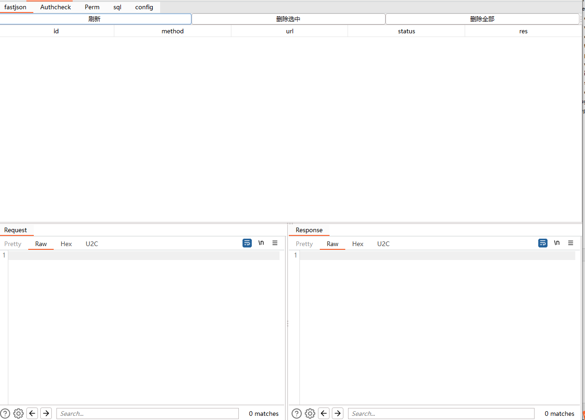
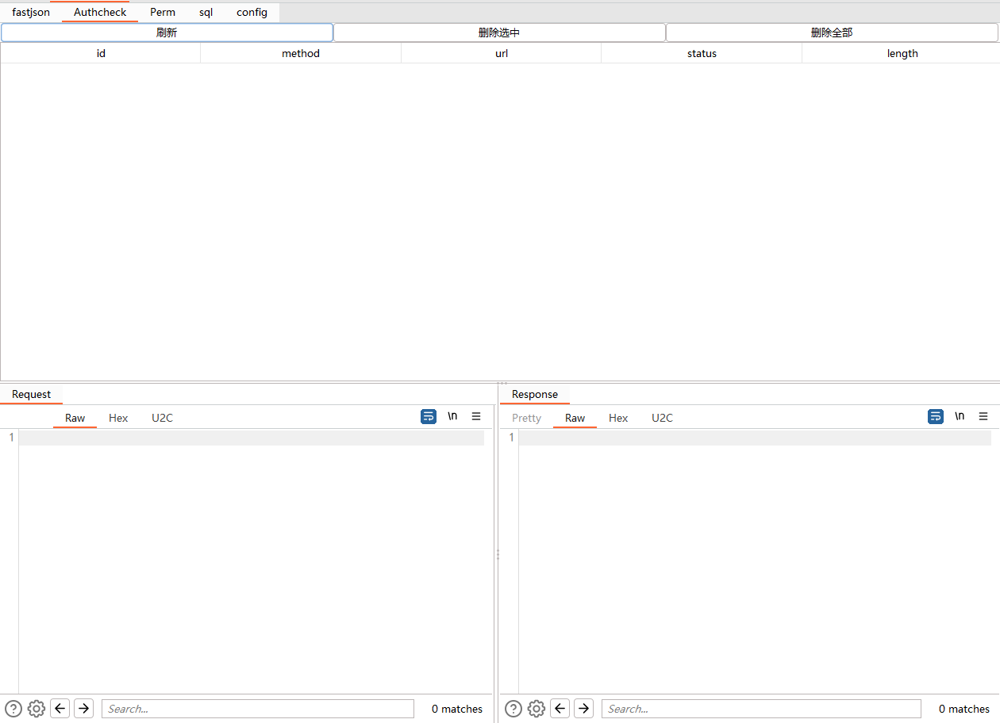
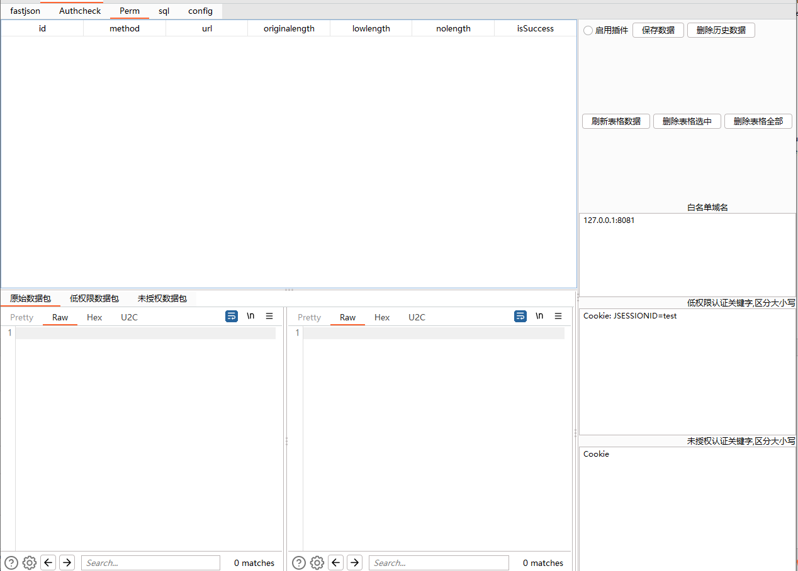
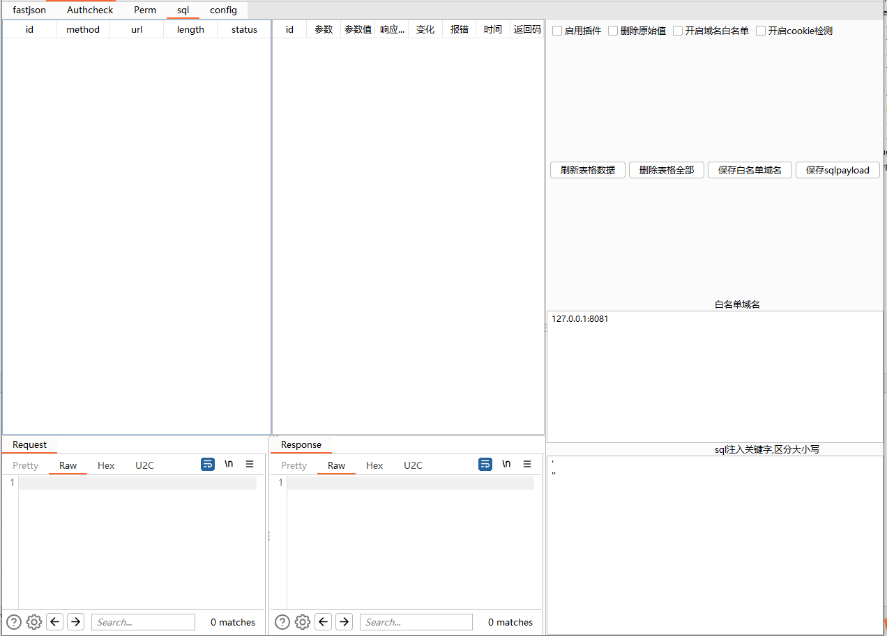
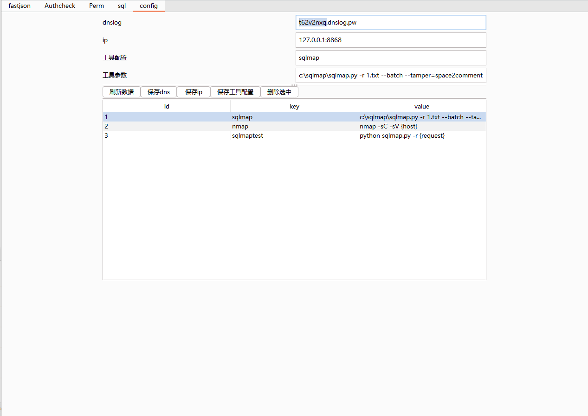
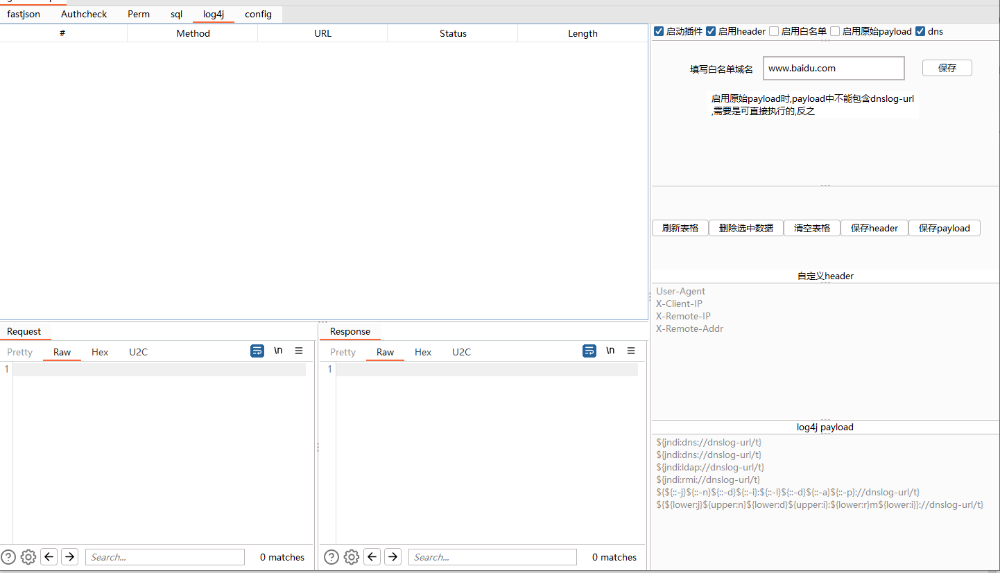
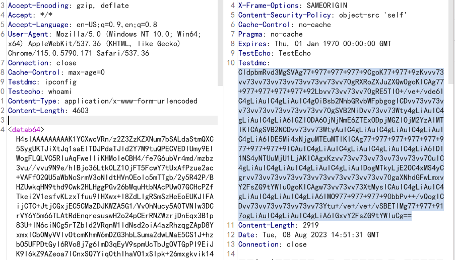

# 项目说明

1. 重新写了UI,表格自动更新
2. 对各个模块的被动扫描做了去重,重复的数据不再扫描
3. 优化json格式的参数解析
4. 各个模块进行优化
5. 数据库配置文件自动生成

# 目前功能

1. fastjson扫描
2. 权限绕过
3. 未授权检测
4. sql注入检测
5. 工具调用
7. log4j检测
8. 复杂数据提交
9. 一键生成nuclei模板

# 使用说明

请使用`mvn clean package`进行编译打包,生成的jar包在target/目录下

请使用`mvn clean package`进行编译打包,生成的jar包在target/目录下

请使用`mvn clean package`进行编译打包,生成的jar包在target/目录下

皆可通过使用鼠标右键菜单,进行调用

# 功能说明

## fastjson扫描

> 使用前请先在配置面板配置dns,ip并点击保存

1. 通过鼠标右键菜单,扫描dns,jndi,回显,报错等
2. dns扫描可以在数据库配置,type为dns,需要在替换dns域名的地方填写FUZZ,并在FUZZ前填写一个字符,如a.FUZZ,主要是为了区别
3. jndi扫描可以在数据库配置,type为jndi,需要在替换jndi的地方填写FUZZ,jndi扫描会让你选择是使用dns还是ip
4. 回显扫描可以在数据库配置,type为echo,需要你填写执行的命令,默认是在请求头加Accept-Cache字段,响应是在响应头Content-auth字段

## 权限绕过

1. 通过给uri中加入特殊字符绕过权限
2. 通过给header中加入字段绕过权限
3. 添加accept头进行绕过

## 未授权检测

> 使用前请先在面板设置相关参数值

1. 通过替换低权限用户的cookie,来判断是否存在未授权
2. 通过删除用户的cookie,来判断是否存在未授权
3. 支持被动扫描

## sql注入检测

> 使用前请先在面板设置相关参数值

1. 通过添加特殊字符,来判断是否存在sql注入
2. sql注入支持get,post,cookie,json等多种方式

## 工具调用

> 使用前请先在面板设置相关参数值,并点击保存

1. 通过添加常用功能,来调用工具
2. {host} 会被替换为当前请求的host
3. {url} 会被替换为当前请求的url
4. {request} 会保存当前数据包到用户名目录的./gather/目录下,进行调用

## log4j检测

1. 支持自定义payload,可通过勾选dns选择是dnslog地址,否则为ip,替换参数为dnslog-url
2. 支持get,post,json,header等多种方式
3. 支持被动扫描

## 复杂数据提交

1. 此功能主要是为了解决burp提交如序列化数据时,解析不出来的问题
2. 请将数据进行base64后,放在`<datab64></datab64>`中,然后点击提交即可

## 一键生成nuclei模板

1. 在request面板使用右击可生成nuclei模板

# 后期计划

1. 如有想法,可以提issue